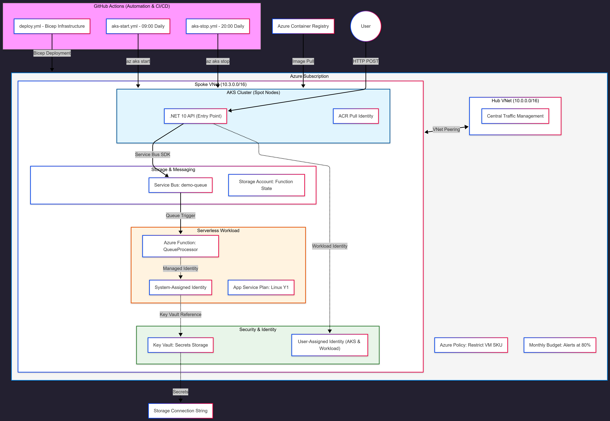

# 🏗️ System Architecture

This document provides a technical deep-dive into the architectural patterns and network topology of the Enterprise Guardrail Platform (EGP).

---

## 🏗️ Architectural Topology (Visualized)

> [!TIP]
> **Architecture Walkthrough:** The EGP follows a Hub-and-Spoke topology to enforce a clear boundary between platform management and application workloads. This design ensures that all traffic is governed by centralized security policies while allowing the Spoke environments to scale independently.

  

---

## 🌐 Network Topology: Hub-and-Spoke

The platform follows the Microsoft Cloud Adoption Framework (CAF) best practices by implementing a **Hub-and-Spoke** network model. This ensures that workloads are isolated from each other while sharing common infrastructure.

### Hub Virtual Network

- **Purpose:** Acts as the central connectivity point for shared services.
- **Address Space:** `10.0.0.0/16`.
- **Future-Proofing:** Prepared for Azure Firewall or VPN Gateway integration to govern all egress/ingress traffic.

### Spoke Virtual Network

- **Address Space:** `10.3.0.0/16`.
- **Subnet Segmentation:**
  - `aks-subnet` (`10.3.1.0/24`): Dedicated for the AKS node pool.
  - `snet-function` (`10.3.3.0/24`): Delegated for Azure Functions integration.
  - `private-endpoints` (`10.3.2.0/24`): Reserved for internal service communication via Private Links.

---

## 🔄 The Event-Driven Pipeline

The MVP implements a robust, asynchronous message-processing flow designed for high availability and decoupling.

1.  **Producer (AKS):** A **.NET 10 Minimal API** receives requests and publishes messages to an **Azure Service Bus** queue (`events`).
2.  **Transport (Service Bus):** Acts as a resilient buffer, handling spikes in traffic and ensuring message persistence.
3.  **Consumer (Azure Functions):** A serverless worker using the **dotnet-isolated** model triggers on new messages, processes them, and logs telemetry to Application Insights

---

## 🛠️ Compute Strategy

The platform utilizes a hybrid compute approach to optimize for both performance and cost:

- **Azure Kubernetes Service (AKS):** Used for the API layer where persistent compute and orchestration are required.
  - **Node Pool:** Utilizes `Standard_B2s` Spot instances to minimize costs by up to 90%.
- **Azure Functions:** Used for background processing.
  - **Hosting:** Consumption (Y1) plan, ensuring we only pay when messages are actually being processed.

---

## 📊 Observability

Monitoring is centralized in a **Log Analytics Workspace**.

- **Application Insights:** Distributed tracing is enabled across the API and Functions to provide a single pane of glass for the entire request lifecycle.
- **Sampling:** Configured in `host.json` to balance visibility with ingestion costs (FinOps principle).
