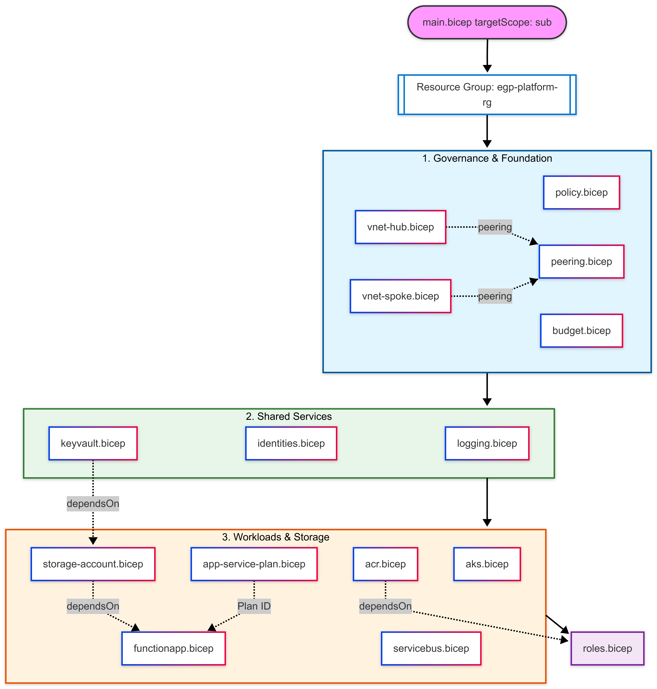

# 🛠️ Infrastructure as Code (IaC)

The EGP platform is 100% defined using **Azure Bicep**, ensuring that the environment is reproducible, version-controlled, and free from configuration drift.

---

## 🛠️ Infrastructure Hierarchy (Visualized)

> [!TIP]
> **Infrastructure Walkthrough:** The EGP is built on a modular Bicep foundation, where each component is treated as a reusable building block. This hierarchical deployment approach ensures that critical foundation layers like networking and logging are established before compute workloads are provisioned.

<p align="center">
  
</p>

---

## 🏗️ Modular Design

The infrastructure is broken down into domain-specific modules to promote reusability and maintainability.

### Core Modules:

- **Networking:** Handles the Hub-and-Spoke VNet creation, subnets, and peering.
- **Security & Identity:** Deploys Managed Identities and configures Key Vault with RBAC-based authorization.
- **Compute (Hybrid):** Orchestrates the AKS cluster (using Spot instances) and the serverless Function App (Y1 plan).
- **Governance:** Deploys Azure Policies and subscription-level budgets from day one.

---

## 🚀 Deployment Orchestration

The deployment follows a hierarchical approach starting from the subscription level.

### 1. Subscription-Level Scope

The `main.bicep` file uses `targetScope = 'subscription'`. This allows the platform to:

- Create the Resource Group (`egp-platform-rg`) dynamically.
- Assign Azure Policies across the entire subscription for strict cost and SKU control.

### 2. Dependency Management

Modules are linked using the `dependsOn` property to ensure the correct creation order:

- **Identity & Key Vault** must exist before the **Storage Account** can automatically inject its connection string as a secret.
- The **Spoke VNet** must be ready before the **AKS** cluster attempts to join its subnet.

---

## ⚡ Key IaC Features

### Automated Secret Handling

A senior highlight of this project is the **zero-touch secret management**.

- When the Storage Account is deployed, the Bicep template automatically retrieves the connection string and creates a secret in Key Vault.
- The Function App then references this secret via its URI, meaning no developer ever handles a raw connection string.

### Subscription Hygiene

To maintain a clean environment, the Bicep code utilizes a naming convention variable (`naming`) that standardizes resource names across the stack, ensuring consistency and making resources easier to track in the Azure Portal.

---

## 🛠️ How to Deploy

The platform is deployed via the [GitHub Actions Workflow](../.github/workflows/deploy.yml) using OpenID Connect (OIDC) for secure, keyless authentication.

```bash
# Manual deployment command (if needed)
az deployment sub create \
  --location swedencentral \
  --template-file infra/main.bicep \
  --parameters alertEmail="your-email@example.com"
```
